# Admin Online Card renewal
##### An Admin guide to navigating Online Card Renewal. Supplementary documentation for Admin Application for Online Cards.
------
### Table of Content
----
  - [ Introduction](#Introduction)
      - [Purpose](#Purpose)
  - [ Sign-in](#sign-in)	
  - [ Application](#Application)
  - [ Route To Me](#Route-To-Me)
  - [ Re-Route](#Re-Route)
  - [ Request ReUpload](#Request-ReUpload)
  - [ Approve/Deny Application](#Approve/Deny-Application)
  - [ Mark Ready for pickup](#Mark-Ready-for-pickup)
  - [ Downloading Application Document](#Downloading-Application-Document)
      
## Introduction
----
This article serves as a supplementary guide for the use of the 
 online Card renewal application. This guide will cover all aspects of the application at launch from your sign-in to the entire process of an application. 

### Purpose
----
The Online Card Renewal application is designed to proccess card renewal without the need for persons to person interaction. It is our hope that this allows for a speedier process for card renewals and creates an simpler process.

## Sign in
----
When first entering the Online Card Renewal application you will be greated by the User Login page. 
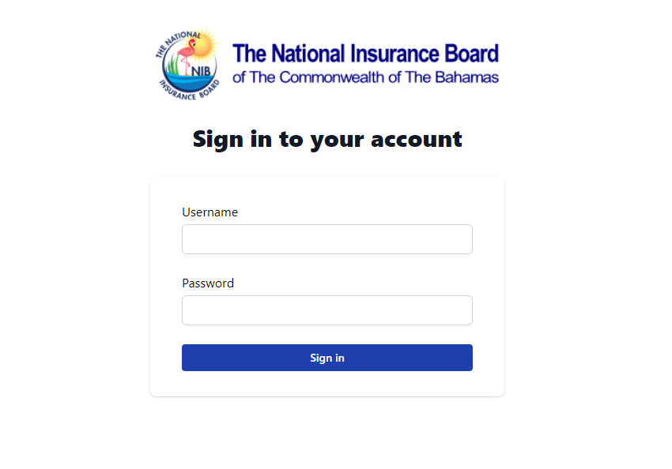

To sign in you simply have to insert your user name and password, into the designated box and press the sign in button. After doing this you should be redirected to the application home screen.During intial setup you may run into an error such as:
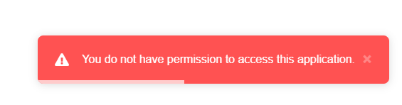  
If this occurs you should contact your supervisor or I.T personnel to gain acces to the Online card renewal application.

Once signed in signing out is a quick and easy process simply Click the user icon in the top right corner. Once you click the icon a drop down tab will appear simply click the log out button and you will be signed out of the application.
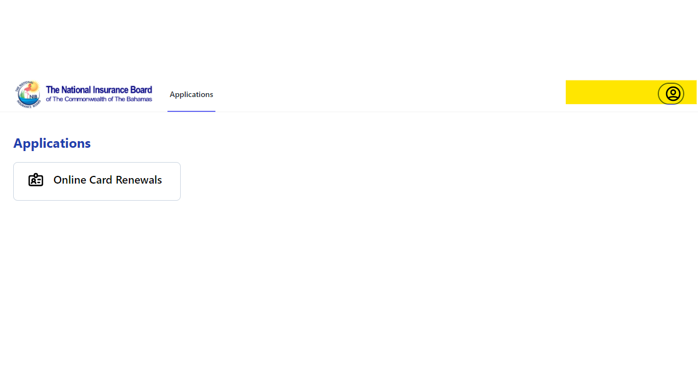
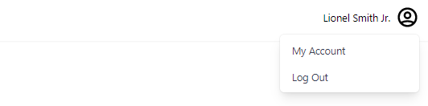
## Application
----
After succesfully signing in user will then be redirected to the application home page. This page allows users access to several key functions. 
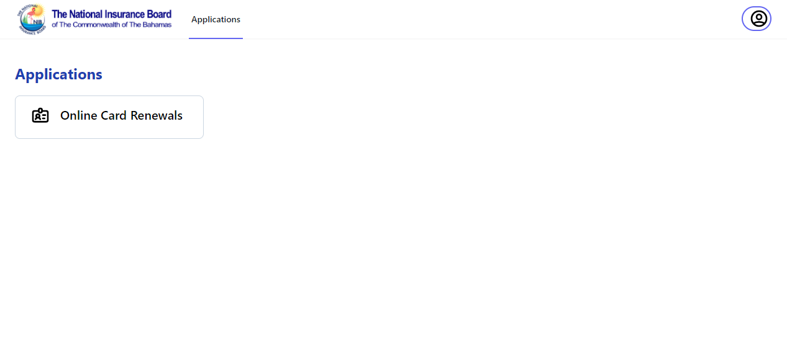
To get started with the online card renewals you'll have to press the Online Card renewal icon found under Applications. 
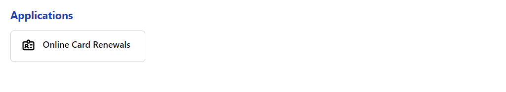
This will take you to the main screen shown below.

here you will find the search function. this function will allow you to find pending, approved or denied application based off of various search filter.
  
Your results will appear below the search function, in the table shown below.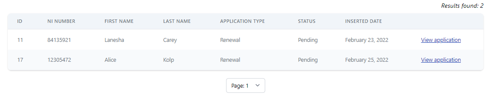  
You can press the view application button to the right of the desired application to get more information or begin work on that application. You will be redirected to the application page shown below.  
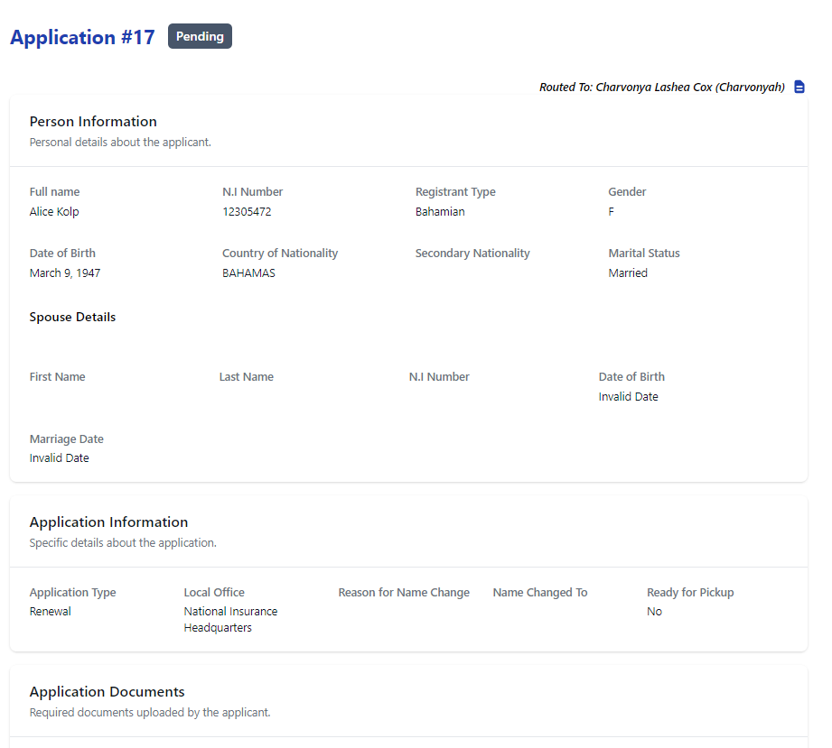  
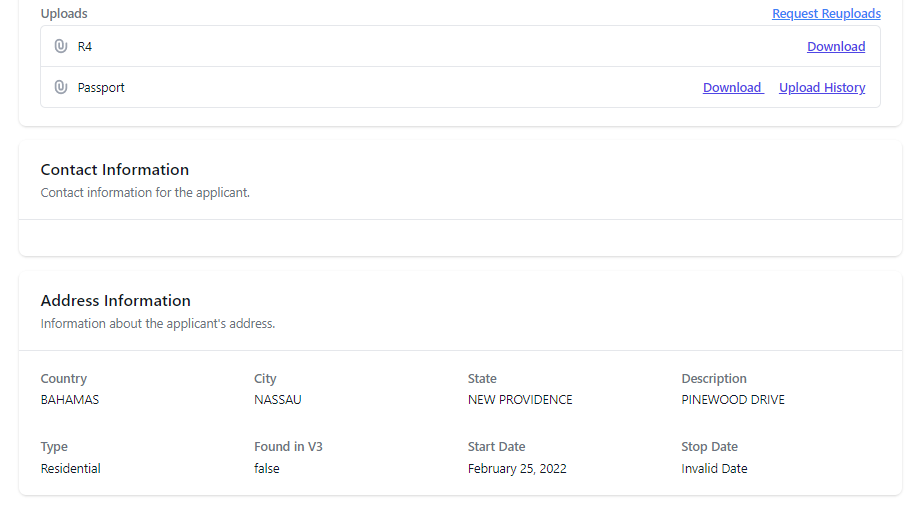  

## Route To Me
----
The route to me function allows users to select applications to that they wish to work on. Users can search for an application that has not been routed yet and route it to themselves. Firstly head to the application home screen, search for your desired application. Once you select you will be taken to the application screen.  
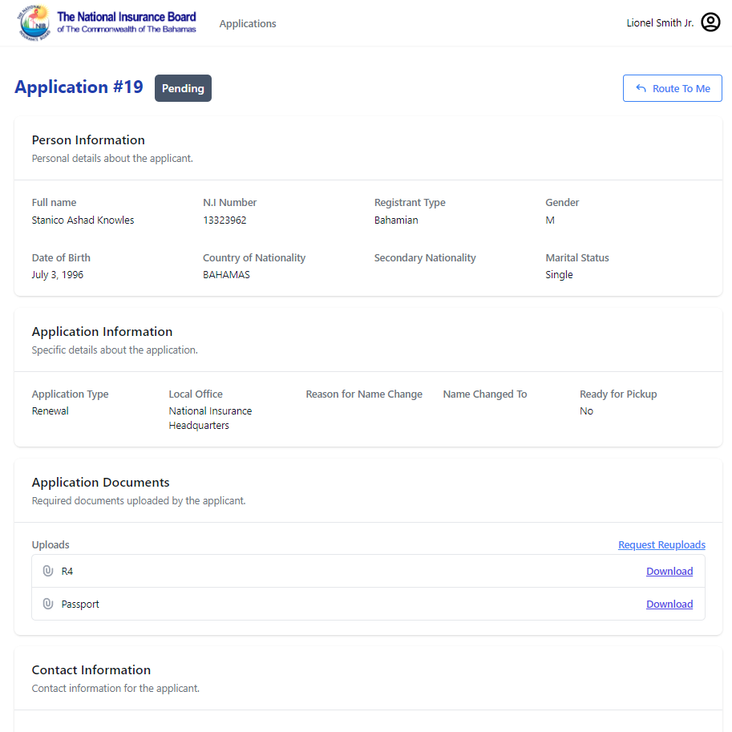  
Next simply press the route to me button in the top right corner. A prompt will then pop up asking to confirm your decision once you select yes the application will then be routed to your account.  
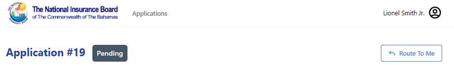  
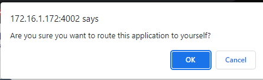
## Re-Route
----
The re-route function is used to route an already routed application to a different user. This action can only be preformed by(). To re-route an application simply search and select the desired application in the online card renewal homepage. Once this is done you will see the route to user button in the top right corner of the page.(shown in photo below)  
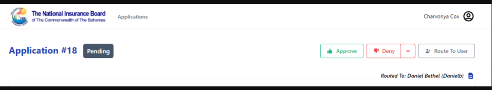  
Next, press the route to user button. This button will bring up a search prompt(Shown below), here you will be insert the name for the user you'd like to route the application to.  
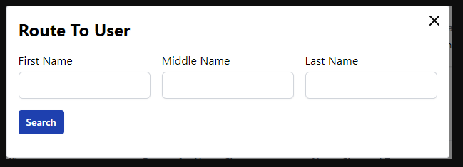  
Finally select the route to button, and selecct ok for the prompt that will appear.
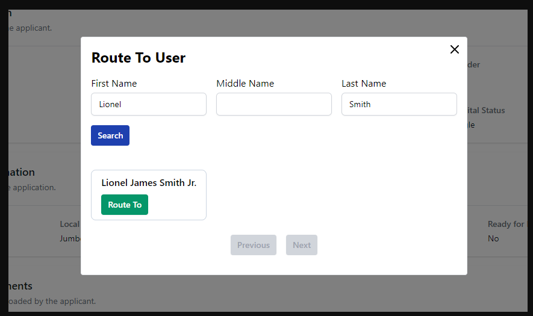
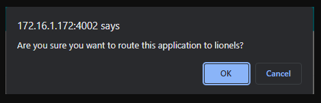

## Request ReUpload
----
Requesting a re-upload is a simple process. First, find the application you are looking to work on. once you've found the application simply scroll down to the upload section shown below.  
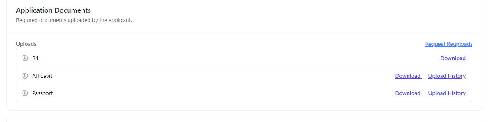
Next, press the request reupload button you will then be greeted with a small pop up window.  
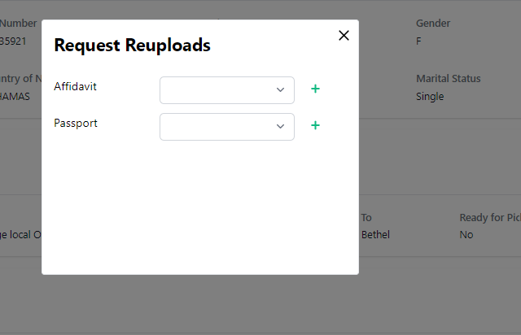  
From this window you will be able to give a reason by clicking the drop down tab and finally pressing the plus button to put in request.  
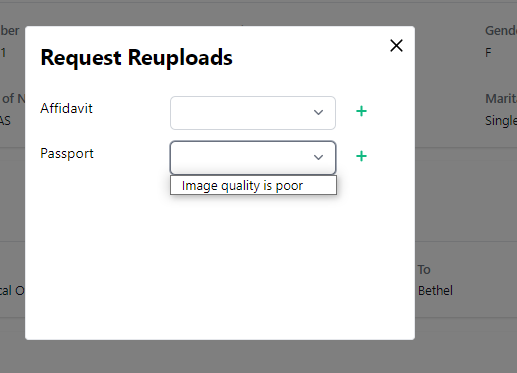  

You will then be notified via email once the client re-uploads the image/document. 

You can check the upload history aswell by simply pressing upload history next to your desired file. A prompt window will then pop-up showing the upload history like the one shown below.  
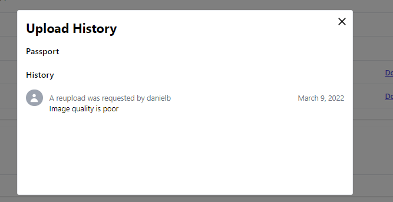

## Approve/Deny Application
----
To Approve/Deny an application the user must sign-in and head to the online card renewal home. Next search for the application you are looking for and select view application for your desired application.   
  
Next select approved or denied and that will allow approve or deny the applicants renewal application.
## Mark Ready for pickup
----
To mark a document ready for pick up you must first approve the clients application. After processing and creating the smartcard you can then click the mark ready for pick up button in the top right corner.  
  
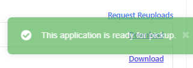  

The users application will then be changed to identify the change in status. you can see this change done under application information.   
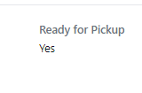  
## Downloading Application Document
----
Downloading application documents is a quick and easy process first search for the head to the online card renewal home page. Select view application for your desired application. 
  
Finally you have to press the download prompt next to the upload you wish to save and the file will be downloaded in the background.

