# NIB Online Portal — Citizen User Guide

**Audience:** Bahamian citizens using the NIB Online Portal to apply for benefits and NIB cards.
**Purpose:** Walks you through every screen and action in the customer portal.
**URL:** [https://nibonline.nib-bahamas.com](https://nibonline.nib-bahamas.com)
**Screenshots captured:** From the staging environment (`staging-nibonline.nib-bahamas.com`) 2026-05-19. Production screens are visually identical.

---

## Quick Map — What You Can Do Here

| Goal | Where to go |
|---|---|
| **Sign in** | [Login page](#1-signing-in) |
| **Create a new NIB Online account** | [Register page](#11-creating-a-new-account) |
| **Forgot your password?** | [Reset password](#12-forgot-password) |
| **Activate your account from an email link** | [Account activation](#13-account-activation) |
| **Apply for a benefit (claims)** | [Submit a claim](#3-applying-for-a-benefit-claims) |
| **Renew your NIB card** | [Card application](#4-applying-for-a-nib-card) |
| **Update your personal information** | [Account Information](#52-account-information) |
| **Add or update banking details** | [Banking Details](#53-banking-details) |
| **Check the status of your applications** | [My Claims / Card Applications](#6-checking-application-status) |
| **Respond to a request to re-upload a document** | [Document reupload](#7-responding-to-a-reupload-request) |
| **Change your password or notification preferences** | [General Settings](#51-general-settings) |

---

## 1. Signing In

When you visit [nibonline.nib-bahamas.com](https://nibonline.nib-bahamas.com), you land on the sign-in page if you're not already logged in.

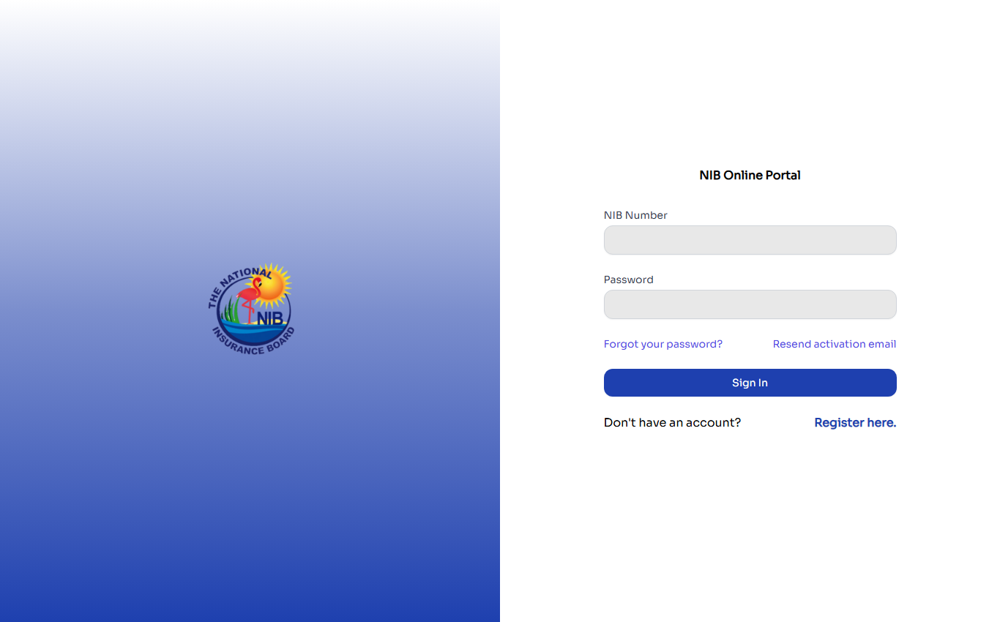

**What you need:**

- Your **NIB Number** (this is your unique citizen identifier — exactly **8 digits**, numbers only)
- Your **password**

If you don't yet have an online account, click **Register here** at the bottom of the sign-in card. If you've forgotten your password, click **Forgot your password?** above the sign-in button. If you registered but never received an activation email (or the link expired), click **Resend activation email** beside the forgot-password link.

After signing in successfully, you land on your **portal home**.

### 1.1 Creating a New Account

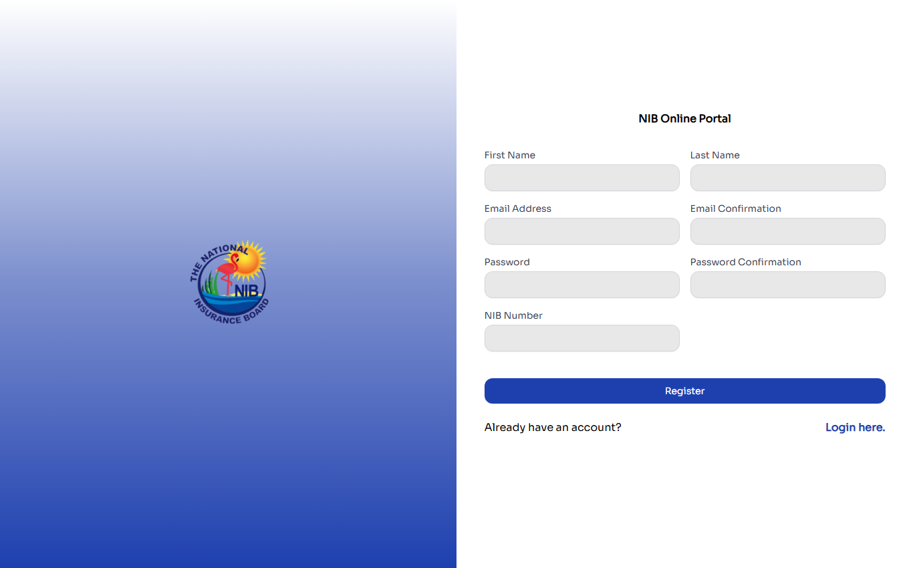

Registration captures just your identity and credentials:

- **First Name** and **Last Name**
- **Email Address** (with confirmation)
- **Password** (with confirmation)
- **NIB Number** (exactly 8 digits)

That's it for registration — you'll add contact info, addresses, and banking details later from your account section. The first and last name you enter must **reasonably match NIB's records** for your NIB number — the check is tolerant of accents, hyphens, and suffixes, but registering under a substantially different name will be rejected. After submitting, NIB sends you an activation email. Click the link to confirm your account before you can sign in.

### 1.2 Forgot Password

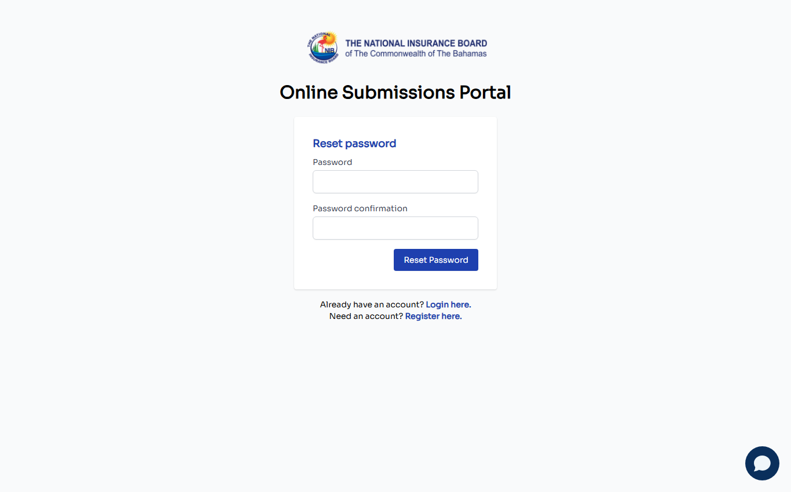

Enter your NIB number — that's all the form asks for. The password-reset email (with a one-time link) is sent to the email address already on file for your account.

### 1.3 Account Activation


The account activation page is what you reach after clicking the link in the activation email NIB sent you when you registered. Without a valid activation token in the URL, this page will show an error — it's not meant to be visited directly.

---

## 2. Your Portal Home

After signing in, you land here. This is the **center of everything** — two large cards represent the two services you can use.

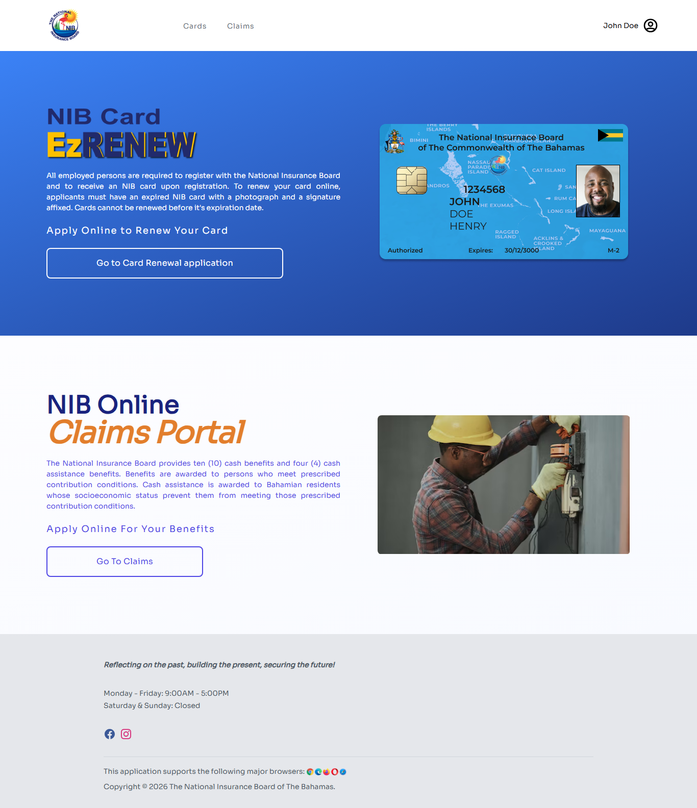

- **Apply Online to Renew your Card** — takes you to the NIB Card renewal flow, branded **EzRENEW**
- **Apply Online for Your Benefits** — takes you to **EzCLAIMS**, the benefit-claims service

In the top-right, your name is displayed (here: "John Doe"). Clicking it opens a menu with your account options and a sign-out link. The top nav has a **Cards** tab and a **Claims** tab — these jump directly to those sections.

---

## 3. Applying for a Benefit (Claims)

Click **Go To Claims** from the portal home (or **Claims** in the top nav) to reach the benefits picker.

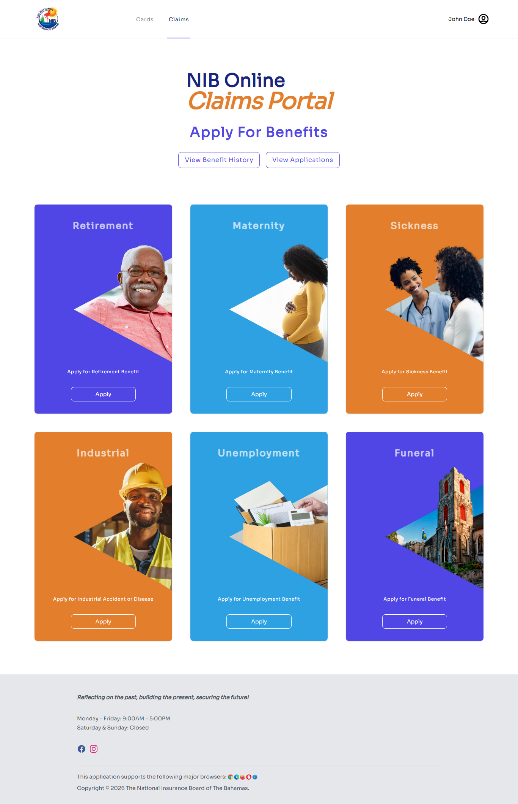

You'll see six benefit cards. Click **Apply** on the one you need:

| Benefit | When to apply |
|---|---|
| **Retirement** | You've reached retirement age and need to claim your pension |
| **Maternity** | You're a working mother and entitled to paid maternity leave |
| **Sickness** | You're temporarily unable to work due to illness |
| **Industrial (Injury & Disease)** | You suffered a workplace injury or occupational disease and need OHSU-related benefits |
| **Unemployment** | You lost your job and need temporary income support |
| **Funeral** | A family member has passed and you're claiming the funeral benefit |

> The **Maternity** and **Sickness** cards do double duty: clicking Apply on either one opens a small modal asking whether you're filing the base benefit or an **Extension** (Maternity Extension / Sickness Extension). Pick the one that applies and you're routed to the right form.

Clicking Apply first shows an **explanatory notes page** for that benefit — eligibility notes and what you'll need — with a button to start the application. The application itself is a **single page** organized into sections (not a multi-step wizard):

- **Your information** — confirms your demographics on file (name, dob, address). Update if anything is out of date.
- **Claim details** — details about the claim (last day of work, employer NIB number, dates of incapacity, etc. — varies by benefit type).
- **Payment details** — choose the bank account you want the benefit paid into. If you haven't added one yet, you'll be prompted to add one here.
- **Documents** — upload supporting documents. What's required varies by benefit type:
  - **Unemployment:** Employer's Certificate of Termination (**B80**) and Dept of Labour Unemployment Card (**B81**)
  - **Sickness:** Doctor's medical certificate (**Med 1**) and employer's certificate (**Med 4**)
  - **Maternity:** **Med 2** and **Med 4**
  - **Industrial (Injury):** **Med 1**, **Med 4**, **B44**, **B45**
- **Disclaimer** — confirm your declaration, then click Submit to send your claim to NIB.

After submission, you'll receive a confirmation email. Your claim moves into the **Pending** state, where an NIB Claims Officer can review it.

### View Your Submitted Claims

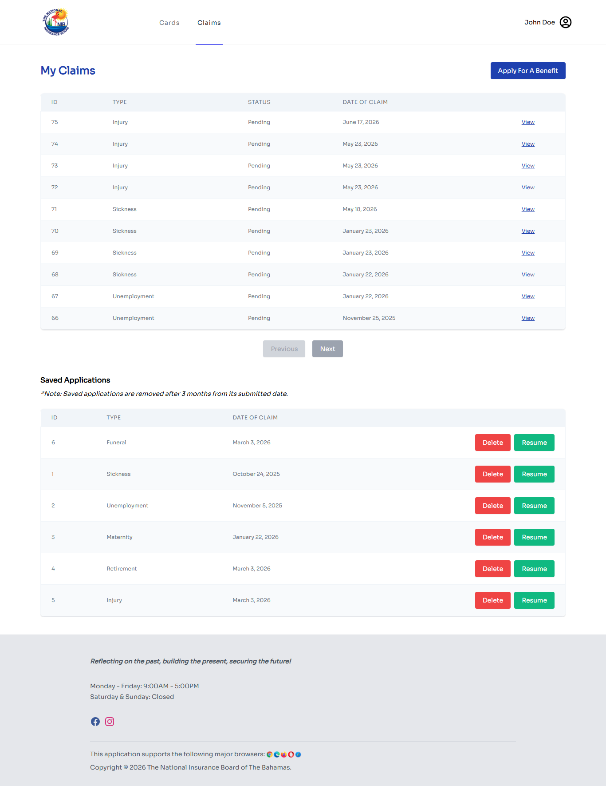

Click **View Benefit History** or **View Applications** from the Claims home to see every claim you've submitted, its current status, and any actions required.

---

## 4. Applying for a NIB Card

Click **Apply Now** under **NIB Card EzRENEW** from the portal home, or click **Cards** in the top nav.

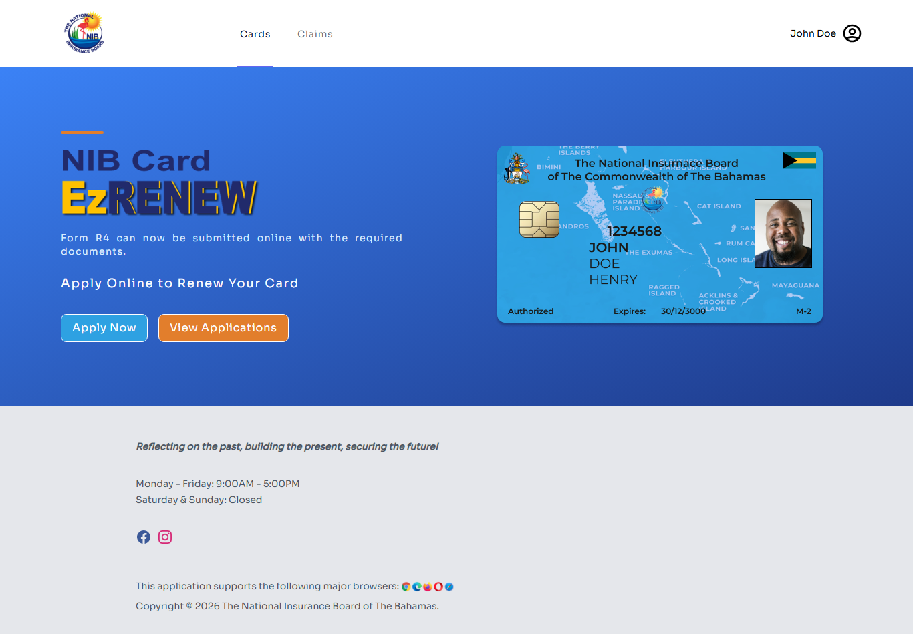

The online card service handles **renewals only** — hence the "EzRENEW" branding. If you've never held a NIB card (first-time card) or your card was lost, damaged, or stolen, you'll need to visit a local NIB office; those application types aren't offered online. *(Internally: `ApplicationType` has no "New Card" value, and while "Replacement" exists in the data model it is not offered anywhere in the UI — there's no police-report document type either.)*

The renewal flow follows this pattern:

1. **Your information** — same demographics confirmation as the claims flow
2. **Personal ID document** — a scan of your identity document (e.g. passport bio page), shown when you're updating your details. *(A passport-style photo upload field exists in the code but is disabled — `Create.vue` hides it with `v-if="false"`, "temporarily hidden". The application does NOT ask for a photo of yourself.)*
3. **Supporting documents** — varies by your situation (marriage certificate for name changes, immigration documents, etc.)
4. **Review and submit**

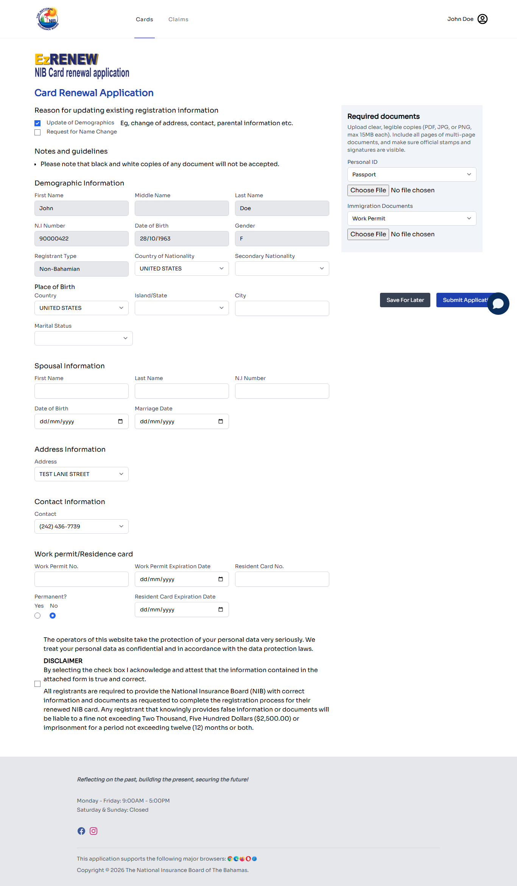

> You can **save for later** at any point. The portal keeps your in-progress application for **3 months from the date the draft was saved/created** (the cleanup job measures from the draft's creation date) before it's automatically removed. To resume, return to the Cards (or Claims) section and click the **Resume** button next to your saved application.

### View Your Submitted Card Applications

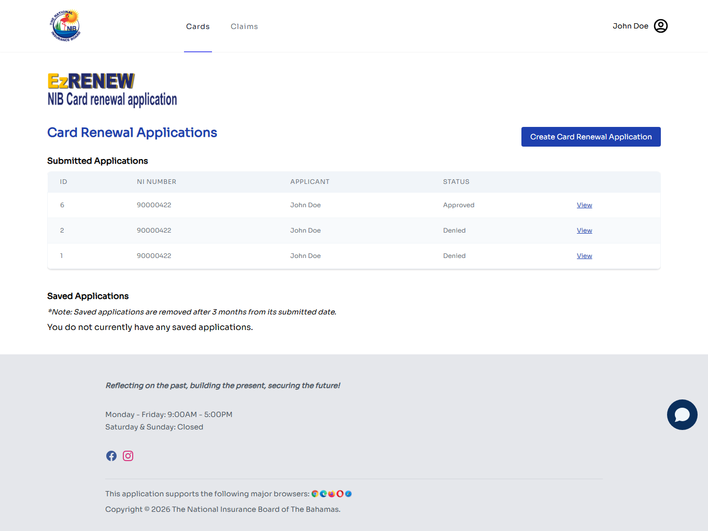

Same idea as the claims list — every card application you've submitted, with status.

---

## 5. Managing Your Account

Click your name in the top-right and choose **My Account**, or visit `/my-account` directly. The My Account section has three sub-pages, shown as a sidebar on the left:

- **General Settings** — password and email
- **Account Information** — your personal details (addresses, contacts)
- **Banking Details** — bank accounts for receiving benefit payments

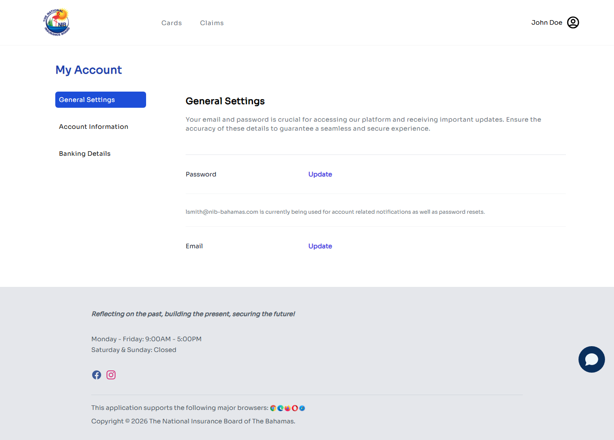

When you first click My Account, you land on **General Settings**.

### 5.1 General Settings

The default page. From here you can:

- **Update Password** — click the **Update** link beside Password. You'll enter a new password (with confirmation). You are **not** asked for your current password — the only restriction is that the new password can't be the same as your existing one.
- **Update Email** — click **Update** beside Email. A **verification link is sent to the NEW address**; the change only takes effect once you click that link. The page also shows which email address is currently being used for account notifications and password resets.

### 5.2 Account Information

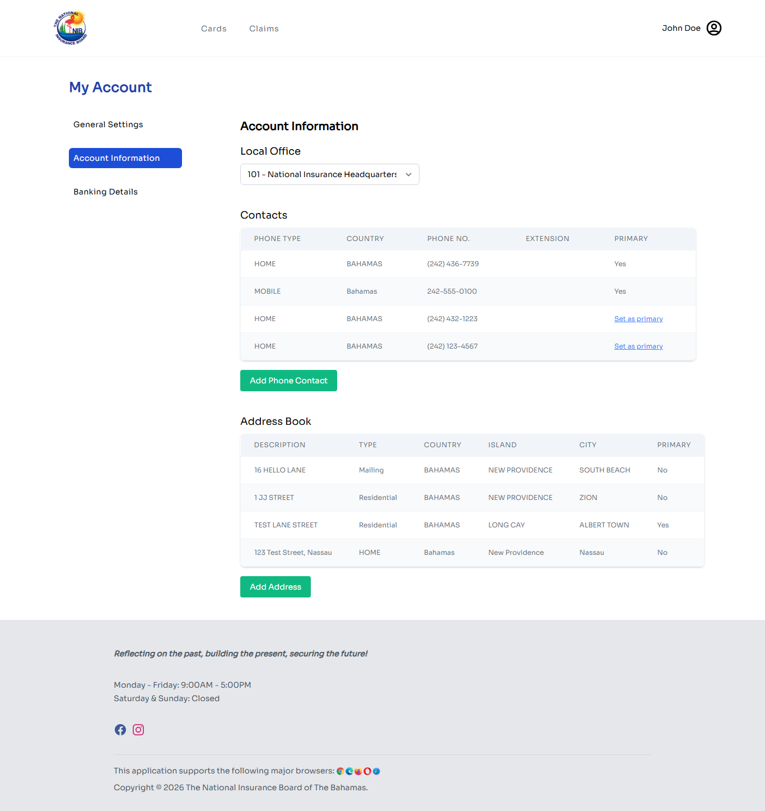

Your **personal information**: addresses, phone numbers, contact details. Update this section if you move, change phone numbers, or update contact information. Changes are saved immediately, and any address or contact change triggers an **account-change alert email** to the address on file. Note that addresses are currently **add-only** in the portal — you can add a new address, but the edit/delete controls are not available *(commented out in the UI)*; contact NIB to correct an existing address.

*(Internally this section is also referred to as "Claimant Information" — same page.)*

### 5.3 Banking Details

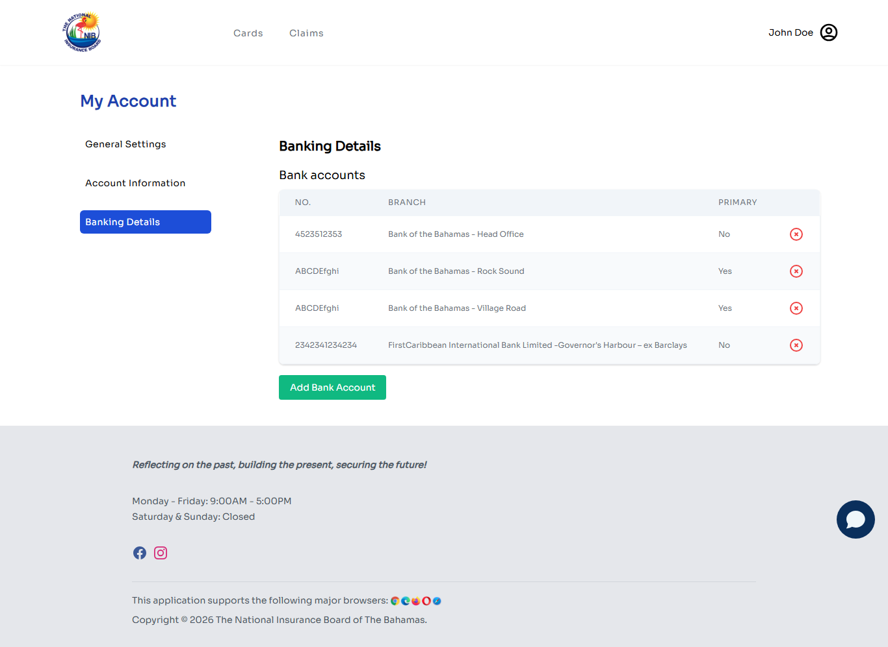

Your bank accounts on file for receiving benefit payments. The page shows a table with **No.** (account number), **Branch**, and **Primary** columns plus a **delete** link per row, and an **Add Bank Account** button below. *(Internal note: the delete link is currently a non-functional TODO stub — it doesn't remove anything. Citizens who need an account removed should contact NIB.)*

- **Add Bank Account** — opens a form with: **account number**, **branch** (dropdown), a **set-as-primary** checkbox, a **document type** selector, and **one file upload** for the supporting document. The document types offered in the UI are **Bank Card** or **Other**. There is no bank-name or account-type field — the branch selection identifies the bank. *(Backend enum also accepts BANK_STATEMENT / BANK_AUTHORIZATION_LETTER / BANK_VERIFICATION_LETTER / BANK_ACCOUNT_OPENING_FORM, but there is no void-cheque type and the UI only exposes the two above.)*
- **Primary** column shows which account receives benefit payments by default. Your **first account is automatically made primary**; after that, the primary flag is set via the checkbox during the add flow — there is no per-row edit or make-primary control.

The supporting document is verified by NIB during application review. You may be asked to re-upload if the document is unreadable or doesn't match the account details.

---

## 6. Checking Application Status

You have two places to check application status:

- **For benefit claims:** Click **Claims** in the top nav → **View Benefit History** ([screenshot above](#view-your-submitted-claims))
- **For card applications:** Click **Cards** in the top nav → **View Applications** ([screenshot above](#view-your-submitted-card-applications))

There are two levels of status — one for the **application** as a whole, and one for each **document** attached to it.

**Application statuses** (the only three that exist):

| Status | What it means |
|---|---|
| **Pending** | Application has been submitted and is awaiting NIB review (or — for saved applications shown in the **Saved Applications** section — still a draft you haven't submitted yet). |
| **Approved** | Your application has been approved. For benefits, payment will follow per the benefit's pay schedule. |
| **Denied** | Your application has been denied. The denial reason will be shown; you can contact NIB if you have questions. |

**Document statuses** (shown per document inside an application's detail page):

| Status | What it means |
|---|---|
| **Submitted** | The document was uploaded and is with NIB. |
| **Reupload Requested** | NIB needs you to upload a clearer or different version of this document. **Action required from you.** See section 7. |
| **Re-Submitted** | You've uploaded a replacement after a reupload request; it's back with the officer. |

For **cards only**, there's an additional **Ready for Pickup** indicator: after your renewal is approved and the card is printed, NIB flags the application as ready for pickup and emails you — your renewed NIB card is ready for collection at your local office. *(Internally this is a boolean `ready_for_pickup` flag set via the admin API, not an application status.)*

The **My Claims** screen above also has a separate **Saved Applications** section at the bottom listing any in-progress drafts. Each saved application has **Resume** and **Delete** buttons.

---

## 7. Responding to a Reupload Request

If an NIB officer reviews your application and finds a document that's unreadable, incomplete, or missing, they'll request a **reupload**. You'll receive an email letting you know *(sent automatically by the admin system when the officer makes the request)*.

**How to respond:**

1. Sign in to the portal.
2. Go to **My Claims** (for benefits) or **Card Applications** (for cards).
3. Open the application named in the email. The reupload request details live on the application's **detail page** — the list page won't flag it, so go by the email.
4. In the documents section you'll see which specific document(s) are marked **Reupload Requested**, and the reason the officer gave.
5. Click the **Upload** or **Replace** action next to that document.
6. Choose a new file from your device.
7. Confirm.

The document is marked **Re-Submitted** and the assigned officer gets an email automatically. No further action is needed unless they request another reupload.

---

## 8. Common Questions

**Q: My NIB number isn't being accepted at sign-in.**
A: NIB numbers must be **exactly 8 digits, numbers only** — the form validates this on both sign-in and registration. Check for typos, extra spaces, letters, or missing digits (if your number was issued with fewer digits, contact NIB to confirm its 8-digit form). If the number is right and you still can't sign in, use **Forgot your password?** or call NIB customer service.

**Q: I registered but never got an activation email.**
A: Check spam/junk first. Then go to the sign-in page and click **Resend activation email**. The portal will look up your NIB number and email you a fresh activation link.

**Q: I uploaded a document but it shows the wrong filename / not visible.**
A: First refresh the page. If it's still missing, contact NIB customer service — there may be a banking-doc routing issue (a known historical bug; see workspace incident notes if you're internal staff).

**Q: How do I know which documents are required for my claim?**
A: Each claim's application page has a documents section that lists required documents before you can submit. If you're missing any, you can't proceed to submit. Save for later, gather your docs, then come back.

**Q: Can I edit a claim after submitting?**
A: Once submitted, you can't edit. You can only respond to reupload requests from an officer. If you submitted incorrect information, contact NIB customer service.

**Q: My card application is taking a long time to approve. What's normal?**
A: Card applications typically process within several business days. You'll receive emails at specific points: a confirmation when you submit, an approved/denied email when an officer decides, a reupload-request email if a document needs replacing, and (for cards) a ready-for-pickup email once your card is printed. If you've waited longer than two weeks without any of these, contact your local NIB office.

---

## 9. Need Help?

Visit your nearest **NIB Local Office** for in-person help. Use the locations page on the public NIB website ([nib-bahamas.com](https://www.nib-bahamas.com)) for hours and addresses.

For password / sign-in issues that the self-service flows can't fix, NIB Customer Service can verify your identity and help recover access.

---

## How These Screenshots Were Captured

These screenshots were captured automatically with **Playwright** running against staging. The capture spec lives at `e2e/specs/customer/screenshots/citizen-walkthrough.spec.ts` in the workspace and can be re-run any time to refresh the visuals (handy when the SPA gets a redesign):

```bash
cd e2e
npx playwright test specs/customer/screenshots/citizen-walkthrough.spec.ts --project=customer-portal
```

Credentials for the test citizen come from `e2e/.env` (`TEST_CUSTOMER_EENI` / `TEST_CUSTOMER_PASSWORD`). Captures land in `development-documentation/onboarding/images/citizen/`.

---

**Next:** see [`06-ADMIN-GUIDE.md`](./06-ADMIN-GUIDE.md) for the NIB staff perspective (reviewing and processing the applications citizens submit here).
