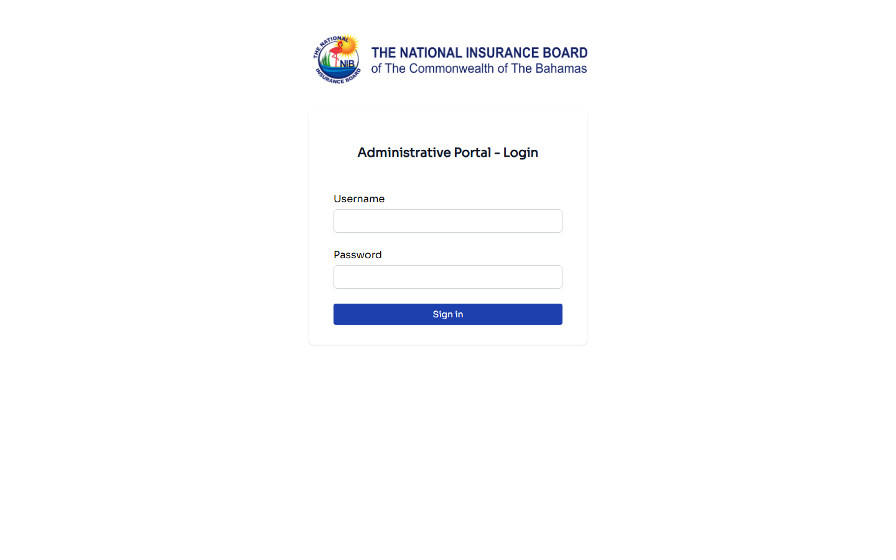
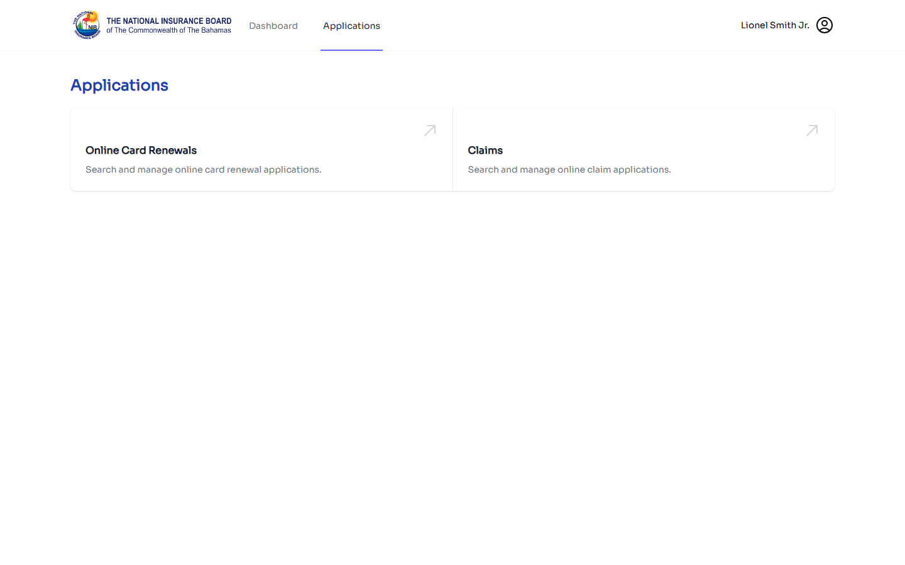
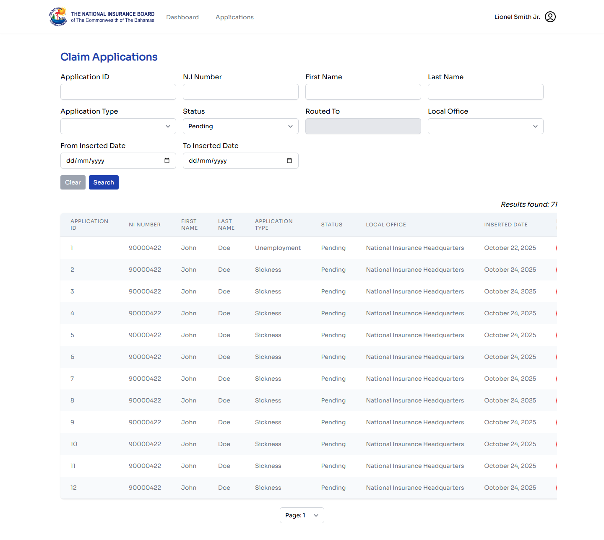
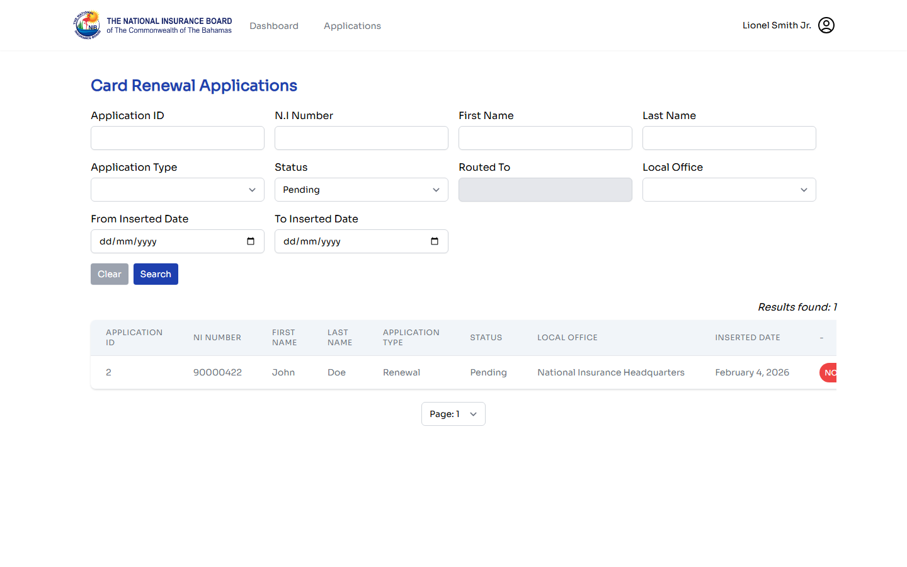
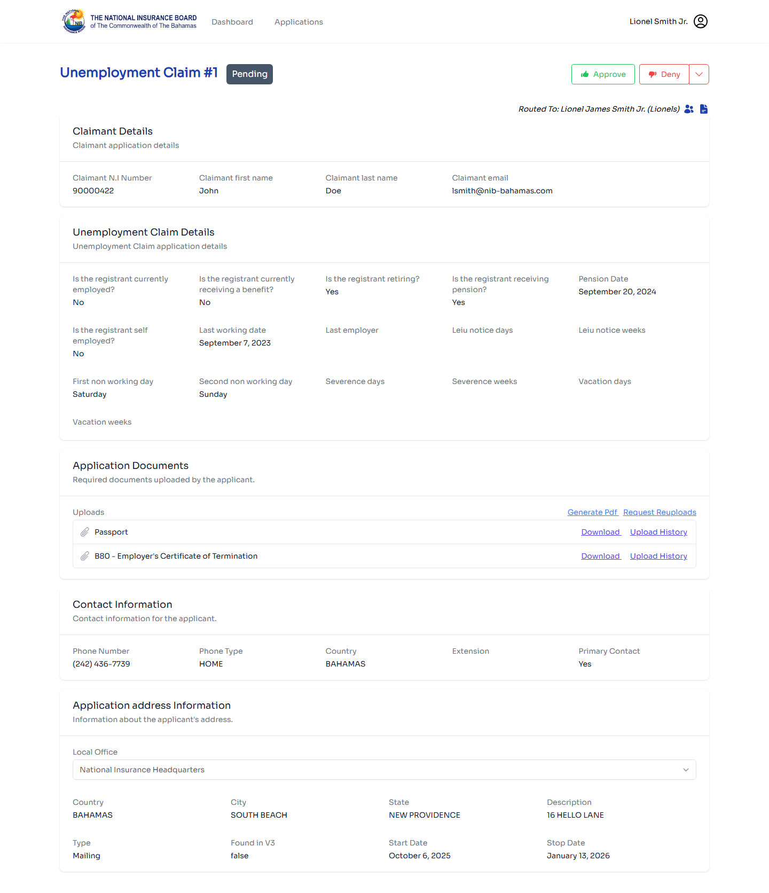
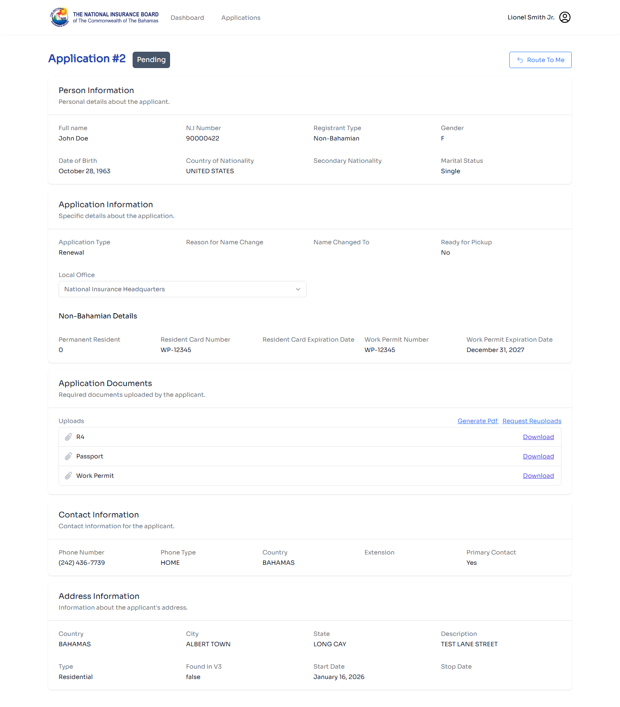

# NIB Online Portal — Admin User Guide

**Audience:** NIB staff who process citizen applications — Customer Service officers, Family Island Unit (FIU) staff, OHSU staff, Registration staff, supervisors, and department heads.
**Purpose:** End-to-end operational walkthrough of the admin portal plus authoritative role reference.
**URL:** [https://nibonline-admin.nib-bahamas.com](https://nibonline-admin.nib-bahamas.com)
**Screenshots captured:** From the staging environment (`staging-nibonline-admin.nib-bahamas.com`) via Playwright, using a `DEPARTMENT HEAD CS`-tier admin account. Production looks identical — same image tag, same SPA. Role-gated UI elements visible here may differ for other roles (see §7 for the role matrix).

---

## Quick Map

| Goal | Section |
|---|---|
| **Sign in (LDAP)** | [Signing in](#1-signing-in) |
| **Find the application I need to review** | [The Queue](#3-finding-an-application-the-queue) |
| **Open an application detail page** | [Application detail](#4-reviewing-an-application) |
| **Download uploaded documents** | [Downloading documents](#41-downloading-documents) |
| **Ask a citizen to re-upload a document** | [Requesting a reupload](#42-requesting-a-reupload) |
| **Route an application to myself or another officer** | [Assignment / routing](#43-routing-and-assignment) |
| **Approve an application** | [Approval](#44-approving-an-application) |
| **Deny an application** | [Denial](#45-denying-an-application) |
| **Generate a form (B80, B81, etc.)** | [Form generation](#46-generating-an-official-form) |
| **Change the local office handling an application** | [Local office change](#47-changing-the-local-office) |
| **See who did what (audit trail)** | [Activity log](#5-activity-log) |
| **Know what my role can / can't do** | [Role reference](#7-role-reference-authoritative) |

---

## 1. Signing In

Open [nibonline-admin.nib-bahamas.com](https://nibonline-admin.nib-bahamas.com) in your browser. You'll land on the admin login screen.



**What you need:**

- Your **LDAP username** (the same one you use for other NIB internal systems)
- Your **LDAP password**

The admin portal authenticates against the corporate LDAP directory. Your **roles** are looked up separately from the Oracle `dbo.security_role_user` table after a successful LDAP password check. That means:

- If your LDAP password is right but you have no admin role, you'll get a "no permission" toast
- If your LDAP password is wrong, you get a login error

If you can't sign in, contact NIB IT to verify your LDAP account and roles. The portal does NOT have a self-service password reset for admin accounts.

---

## 2. The Applications Hub

After signing in, you land on the **Applications hub** — a chooser for the two application domains you can work in.



Two large cards represent the two domains:

- **Online Card Renewals** — Search and manage online card renewal applications.
- **Claims** — Search and manage online claim applications.

Click either card to jump into that domain's queue. The top nav has two tabs — **Dashboard** and **Applications** — plus your name and an account menu in the top right.

> The Dashboard tab (the `/dashboard` route) currently displays the same content as the Applications hub for most roles. Aggregate statistics may render here for users with elevated visibility (Department Head, Manager FIU).
>
> Your hub contents depend on your role. Supervisors and department heads see broader views; non-supervisor CS officers and non-supervisor FIU staff see only what's assigned to them or to their local office. See [Role Reference](#7-role-reference-authoritative).

---

## 3. Finding an Application (The Queue)

Click **Online Card Renewals** or **Claims** from the Applications hub to reach the queue for that domain.

### 3.1 Claim Applications queue



The queue is a paginated, filterable table of claim applications. The header shows the result count (e.g., **"Results found: 71"**) and the table lists Application ID, NI Number, claimant name, application type (Sickness, Unemployment, etc.), status, local office, and inserted date. Click any row to open the detail page.

### 3.2 Card Applications queue



Identical filter form to claims, but result rows show **Application Type** values like "Renewal" instead of benefit types. The right-most column may show a "NO ACTION" tag for applications with outstanding work.

### 3.3 Common filters

Both queues share the same filter form at the top:

| Filter | What it shows |
|---|---|
| **Pending Review** | Submitted, not yet routed to anyone |
| **Assigned to Me** | Applications you've routed to yourself |
| **Routed-To** | Filter by specific officer (supervisors / dept heads only) |
| **Local Office** | Filter to a specific office (FIU managers / dept heads only) |
| **Status** | Submitted / In Review / Approved / Denied / Reupload Requested |
| **Date range** | Submission window |
| **Application type** | (Claims only) Sickness, Unemployment, Maternity, etc. |
| **NIB number / claimant name search** | Find a specific citizen's application |

The **Routed-To** column shows which officer currently owns the application. An empty Routed-To means nobody has picked it up yet.

> Known issues on the admin SPA at time of writing: Routed-To search isn't working (task #56), Claims filter shortcuts aren't working (task #57). Use the date / status / name filters as a workaround.

---

## 4. Reviewing an Application

Click any row in the queue to open the application detail page. The layout differs slightly between claims and cards but both follow the same skeleton.

### Claims application detail



A claims detail page shows the claim type as the header (e.g., **"Unemployment Claim #1"**) with status badge, **Approve / Deny** action buttons in the top right (visible only if you have the [claims `canEdit` role](#74-what-each-role-can-do--claims-portal)), **Routed To: <officer>**, and sections for:

- **Claimant Details** — name, NI Number, email
- **<Claim Type> Claim Details** — claim-type-specific fields (e.g., Unemployment: last working date, employer, pension info, leiu notice days, severance days, vacation days)
- **Application Documents** — uploaded files (passport, B80 Employer's Certificate, etc.) with **Download**, **Upload History**, plus top-right **Generate Pdf** and **Request Reuploads** action links
- **Contact Information** — phone numbers + primary contact flag
- **Application address Information** — claimant's mailing/physical address
- Below: **Activity Log** (audit trail)

### Card application detail



A card detail page shows simpler header (e.g., **"Application #2"** with status), and the action buttons depend on your role:

- If you have cards `canEdit` (Supervisor R / Dept Head R / Manager FIU / Sub Office Manager FIU): **Approve / Deny / Ready for Pickup**
- Otherwise: only **Route To Me** (the only action a non-canEdit role can take)

Sections:

- **Person Information** — full name, NI Number, **Registrant Type** (Bahamian / Non-Bahamian), gender, DOB, country of nationality, marital status
- **Application Information** — application type (New / Renewal / Replacement), reason for name change (if applicable), name changed to, **Ready for Pickup** flag, **Local Office** dropdown
- **Non-Bahamian Details** — *(visible only for non-Bahamian registrants)*: permanent-resident flag, resident card number + expiry, work permit number + expiry
- **Application Documents** — R4 form, Passport, Work Permit, etc. (varies by registrant type and application type)
- **Contact Information** + **Address Information**

### Detail-page sections at a glance:

1. **Header** — claimant name, NIB number, application type, status, submission date, current routed-to officer
2. **Demographic information** — addresses and contacts on file (read from `demographic-service`)
3. **Banking details** — bank account the citizen selected for the benefit payment (claims) or the photo for the card (cards)
4. **Application-specific data** — for claims: dates of incapacity, employer info, dependent info, etc. For cards: photo, marriage cert if name change, etc.
5. **Uploaded documents** — list of documents the citizen uploaded with this application
6. **Action buttons** — approval, denial, reupload request, assignment (visibility depends on your role and the current status)
7. **Activity log** — full audit trail at the bottom

### 4.1 Downloading Documents

Each uploaded document row has a **download** action. Click it to get the file (PDF, JPG, PNG). The download is served by `online-claims-admin` (or `online-cards-admin`) reading from the shared file volume — the same files the citizen uploaded land directly on the admin's volume mount.

> If a document fails to download with a `400 File does not exist`, the issue is almost always a stale `application_docs.file_path` row (historical bug B2 — leading-slash corruption). Escalate to engineering rather than asking the citizen to re-upload.

### 4.2 Requesting a Reupload

If a document is unreadable, incomplete, or the wrong document type, click **Request Reupload** next to it.

You'll be asked to provide a **reason** from a predefined list:

- Unreadable / blurry
- Wrong document type
- Document is incomplete
- Document is expired
- (Plus a free-text option)

After confirming, the system:

1. Updates the document's status to **REUPLOAD_REQUESTED**
2. Sends the citizen an email letting them know
3. Surfaces a prompt to the citizen on their next sign-in (the customer SPA shows a banner on the application list)

The application is now waiting on the citizen. Once they upload a replacement, the document status goes back to **SUBMITTED** and you can review the new file.

### 4.3 Routing and Assignment

Each application needs a **routed-to** officer before it can be acted on. Options:

- **Route to Me** — most common. Claims a brand-new submitted application for yourself.
- **Reassign** — supervisors/managers can hand an application off to another officer. Available on the detail page if you have the `canEdit` role for the domain.
- **Remove Assignment** — clears the routed-to officer, returning the application to the unrouted pool.

**Critical:** approval / denial actions require an active routed-to officer. The system blocks these actions on unrouted applications.

### 4.4 Approving an Application

Once you've reviewed all documents and the citizen's information looks correct:

1. Confirm the application is routed to you (or to someone you have authority to act on behalf of)
2. Click **Approve**
3. A confirmation dialog appears
4. Click **Confirm Approval**

For **cards**, the next status is typically **Ready for Pickup** (the card is printed and waiting at the local office) or **Approved** (digital-only flow).

For **claims**, the next status is **Approved** — payment scheduling is handled downstream of this portal.

The citizen receives an approval email automatically.

> The Approve button is only visible if you have a `canEdit` role for the domain. See section 7.

### 4.5 Denying an Application

If you decide an application doesn't meet the requirements:

1. Confirm assignment (same as approval)
2. Click **Deny**
3. Choose a **denial reason** from the dropdown. The list is configurable per application type but typically includes things like:
   - Insufficient contributions
   - Eligibility period not met
   - Missing or invalid documents
   - Duplicate application
   - (Other — with required free-text)
4. Optionally add notes
5. Confirm

The citizen receives a denial email automatically that includes the reason.

> Deny is also gated by `canEdit`. Non-supervisor CS officers can `route` and `request reupload` but cannot directly approve or deny.

### 4.6 Generating an Official Form

For claims applications, several NIB forms can be auto-generated as PDF based on the submitted data:

- **B80** — Employer's Certificate of Termination (Unemployment benefit)
- **B81** — Medical Certificate (Sickness, Maternity, etc.)
- Other forms per claim type

Click **Generate Form** on the application detail page, choose the form type, and the system renders a PDF using Jinja2 templates plus the data the citizen submitted. The PDF is downloaded to your machine.

> Form generation uses WeasyPrint server-side. If a citizen didn't provide a required field (e.g., "last employer NIB number" on Unemployment), the form shows a fallback like *"See attached B80"* per Adena's policy — empty fields are NOT an error.

### 4.7 Changing the Local Office

If an application landed on the wrong office (e.g., citizen entered the wrong office during registration), supervisors and managers can reassign it to the correct office. From the detail page, click the local-office field, choose a new office, and confirm. The application moves to the new office's queue.

---

## 5. Activity Log

Every action (assignment, reupload request, approval, denial, document download, local office change) is logged with a timestamp and the acting officer's identity. Scroll to the **Activity Log** section at the bottom of the application detail page to see the complete audit trail.

Filter by activity type or date range if the log is long.

> The activity log is stored in the `online_claims_admin` / `online_nib_cards_admin` Oracle schemas. It's not just a UI feature — it's the regulatory audit trail.

---

## 6. The Dashboard / Statistics

The **Dashboard** tab in the top nav is where aggregate statistics for your scope render. For most roles, it currently displays the same Applications hub layout shown in §2. Roles with elevated visibility (Department Head, Manager FIU, etc.) may see additional widgets:

- Pending review count
- Applications routed to me
- Average processing time (within your office, if supervisor)
- Approval/denial rates

Department heads see office-wide stats. Managers see Family Island Unit stats. CS Officers see their own caseload.

---

## 7. Role Reference (Authoritative)

The admin portal uses **5 role categories** organized by department. Each role grants different access. **A user can have multiple roles** (e.g., an officer may carry both Cards and Claims roles).

Roles come from the Oracle `dbo.security_role_user` table, **not** from LDAP groups. LDAP only validates the password.

### 7.1 The Five Categories

| Category | Suffix | What they do |
|---|---|---|
| **Registration (`R`)** | "...R" | Process NIB card applications |
| **Customer Service (`CS`)** | "...CS" | Process claims applications |
| **Family Island Unit (`FIU`)** | "...FIU" | Process applications from non-Nassau islands (geographic) |
| **IT** | "...IT" | View access for support; security manager has elevated access |
| **OHSU** | "...OHSU" | Occupational Health and Safety Unit — process Injury Benefit claims |

### 7.2 Verified Role Inventory

From `online-submissions-admin-frontend/src/enums/user-roles.enums.ts`:

```
Registration (Cards):
  NON SUPERVISOR R
  SUPERVISOR R
  DEPARTMENT HEAD R

Customer Service (Claims):
  NON SUPERVISOR CS
  SUPERVISOR CS
  DEPARTMENT HEAD CS

Family Island Unit (cross-domain):
  NON SUPERVISOR  FIU      (two spaces — legacy data convention)
  SUPERVISOR FIU
  MANAGER FIU
  SUB OFFICE MANAGER FIU

IT (cross-domain):
  NON SUPERVISOR IT
  SUPERVISOR IT
  SECURITY MANAGER IT

OHSU (Claims — Injury Benefit only):
  NON SUPERVISOR  OHSU     (two spaces)
  DEPARTMENT HEAD  OHSU
```

> The double-space in `"NON SUPERVISOR  FIU"` and `"NON SUPERVISOR  OHSU"` is intentional — it matches the legacy Oracle data and must be preserved when assigning roles.

### 7.3 What Each Role Can Do — Cards Portal

Read access (can view the cards queue + open application details):

- All Registration roles (`R`)
- All Family Island roles (`FIU`)
- All IT roles

Write access (can approve / deny / request reupload — the `canEdit` set from `useCards.ts`):

- `SUPERVISOR R`
- `DEPARTMENT HEAD R`
- `MANAGER FIU`
- `SUB OFFICE MANAGER FIU`

So a `NON SUPERVISOR R` officer can review and route a card application, but only the supervisor-tier roles can approve or deny it.

### 7.4 What Each Role Can Do — Claims Portal

Read access:

- All Customer Service roles (`CS`)
- All Family Island roles (`FIU`)
- All IT roles
- All OHSU roles

Write access (the `canEdit` set from `useClaims.ts`):

- `DEPARTMENT HEAD CS`
- `MANAGER FIU`
- `SUB OFFICE MANAGER FIU`
- `DEPARTMENT HEAD  OHSU`

> Notice: Claims `canEdit` is **stricter** than Cards. `SUPERVISOR CS` does **not** have approve/deny rights on claims — only the Department Head does. This is by design.
>
> OHSU Department Head can approve/deny claims because OHSU handles Injury Benefit specifically.

### 7.5 Role-by-Role Matrix

| Role | Cards: view | Cards: approve/deny | Claims: view | Claims: approve/deny | Notes |
|---|---|---|---|---|---|
| `NON SUPERVISOR R` | ✓ | ✗ | ✗ | ✗ | Cards-only CS officer (Registration office) |
| `SUPERVISOR R` | ✓ | ✓ | ✗ | ✗ | Cards supervisor |
| `DEPARTMENT HEAD R` | ✓ | ✓ | ✗ | ✗ | Cards department head |
| `NON SUPERVISOR CS` | ✗ | ✗ | ✓ | ✗ | Claims CS officer (read + route, no approve) |
| `SUPERVISOR CS` | ✗ | ✗ | ✓ | ✗ | Claims supervisor — can route + reassign, NOT approve |
| `DEPARTMENT HEAD CS` | ✗ | ✗ | ✓ | ✓ | Claims department head — full approve/deny |
| `NON SUPERVISOR FIU` | ✓ | ✗ | ✓ | ✗ | Family Island junior officer — both domains, read+route only |
| `SUPERVISOR FIU` | ✓ | ✗ | ✓ | ✗ | Family Island supervisor — read+route, no approve |
| `MANAGER FIU` | ✓ | ✓ | ✓ | ✓ | Family Island manager — full approve/deny on both |
| `SUB OFFICE MANAGER FIU` | ✓ | ✓ | ✓ | ✓ | Sub-office manager — full approve/deny on both |
| `NON SUPERVISOR IT` | ✓ | ✗ | ✓ | ✗ | IT support — view-only |
| `SUPERVISOR IT` | ✓ | ✗ | ✓ | ✗ | IT supervisor — view-only |
| `SECURITY MANAGER IT` | ✓ | ✗ | ✓ | ✗ | IT security — view-only |
| `NON SUPERVISOR OHSU` | ✗ | ✗ | ✓ | ✗ | OHSU staff — claims read+route for injury benefits |
| `DEPARTMENT HEAD OHSU` | ✗ | ✗ | ✓ | ✓ | OHSU dept head — full approve/deny |

> **A 2026-03-24 gotcha:** the frontend `canEdit` lists must stay in sync with backend `admin_decorator.py`. Once `useCards.ts` was missing `MANAGER FIU` — backend allowed the action but the UI hid the button, causing a "why can't I click Approve" support ticket. If you find a button missing for a role that should have access, file the discrepancy with engineering.

### 7.6 Multi-Office Scoping

By default, a CS officer or non-supervisor FIU staff sees only applications routed to **their local office**. Supervisors and managers see broader scopes:

| Role | Office scope |
|---|---|
| CS Non-Supervisor | Their local office only |
| CS Supervisor | Their local office only (NOTE: cannot approve, but full visibility within office) |
| Department Head CS | All offices (nationwide for claims) |
| FIU Non-Supervisor | Their Family Island office only |
| FIU Supervisor | Their Family Island office only |
| Manager FIU | All Family Island offices |
| Sub Office Manager FIU | Their sub-office only |
| Registration roles | All Registration offices (cards are centrally processed) |

> A pending request from Adena Minus (task #88) is to give the CS team broader cross-office visibility so they can process claims from any island regardless of office assignment. Not yet implemented.

---

## 8. Common Operations

### Search for a specific citizen's application

Use the **search bar** on the claims or cards queue. Search by NIB number or claimant name. The Routed-To search field is currently broken (task #56) — use NIB number search instead until that's fixed.

### Find applications I've been working on

Filter by **Routed-To: Me** (or your username) on the queue page. Or visit `/dashboard` and look at the "Assigned to me" widget.

### Bulk-process a backlog

There's no bulk-approve/deny — every application is acted on individually. Bulk reupload-requests across multiple documents on a single application IS supported (request reupload on multiple docs in one action).

### Audit who did what

Open the application detail page → scroll to **Activity Log** at the bottom. Filter by date or user if the log is long.

### Re-route an application that was incorrectly assigned

If an application was routed to the wrong officer (e.g., they're out of office):

1. Open the application detail page
2. Click **Reassign** (requires `canEdit` role or `Manager` / `Dept Head` permission)
3. Choose the new officer
4. Confirm

The previous routed-to officer is notified.

### Change the local office

If an application landed on the wrong office, change it from the detail page (see [section 4.7](#47-changing-the-local-office)).

---

## 9. Known Issues at Time of Writing

| Issue | Workaround | Tracking |
|---|---|---|
| **Routed-To search broken** | Use NIB number search instead | Task #56 |
| **Claims filter shortcuts broken** | Use status + date filters manually | Task #57 |
| **Admin SPA — dark mode white panels** on application detail | Switch to light mode | Task #60 |
| **Sometimes "no permission" on a role that should have access** | Verify `useCards.ts` / `useClaims.ts` `canEdit` includes your role; file ticket | — |
| **Banking-doc reupload requests via admin** route through `demographic-service` — visible on customer side but UI text says "claims-admin" | UX wording only; the routing is correct | — |

---

## 10. Need Help?

**LDAP / sign-in issues:** Contact NIB IT helpdesk.

**Role assignment requests** (e.g., "I should be a SUPERVISOR but I'm only NON SUPERVISOR"): submit through your department head, who can have NIB IT update the `dbo.security_role_user` table.

**A bug in the admin SPA:** Report to the engineering team — they may need a screenshot, the application ID, and your role.

**A question about a specific application's data integrity** (e.g., "Why isn't the banking doc showing?"): Engineering can run database queries against `online_claims_admin` / `online_nib_cards_admin` schemas.

---

## How to Regenerate These Screenshots

This guide's screenshots are captured automatically using **Playwright** via `e2e/specs/admin/screenshots/admin-walkthrough.spec.ts`. To refresh after a UI redesign or to fill in the placeholders:

```bash
# Step 1: Add admin credentials to e2e/.env (one-time)
#   TEST_ADMIN_USERNAME=<your-ldap-username>
#   TEST_ADMIN_PASSWORD=<your-ldap-password>

# Step 2: Run the capture
cd e2e
npx playwright test specs/admin/screenshots/admin-walkthrough.spec.ts --project=admin-portal

# Captures land in:
#   development-documentation/onboarding/images/admin/
```

The captures use the LDAP user's actual roles to render screens — so screens you can see depend on the test account's role. For full role-by-role coverage you'd need multiple test accounts with different role assignments. For most documentation purposes, a single Department-Head-tier account (which sees everything) is sufficient.

> Note: the captures embedded in this doc were taken using a `DEPARTMENT HEAD CS` test account (LDAP user `lionels`). That role has claims approve/deny rights but NOT cards approve/deny rights — which is why the cards detail page shows only **"Route To Me"** in §4 while the claims detail shows **Approve / Deny**. If you'd like role-specific variants for other roles, run the capture from an LDAP account with that role.

---

**Related reading:**

- [`05-CITIZEN-GUIDE.md`](./05-CITIZEN-GUIDE.md) — the citizen view (what citizens see and do)
- [`02-ARCHITECTURE.md`](./02-ARCHITECTURE.md) §5.2 — admin authentication architecture
- [`03-SERVICES.md`](./03-SERVICES.md) — `online-claims-administrative-api`, `online-cards-admin-api`, and `admin-auth` for technical detail
- [`04-DEPLOYMENT.md`](./04-DEPLOYMENT.md) — how the admin portal is deployed
